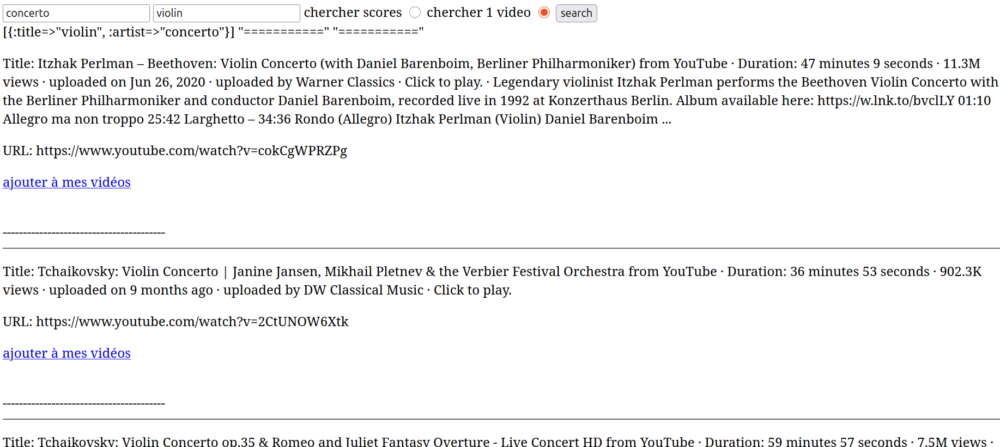
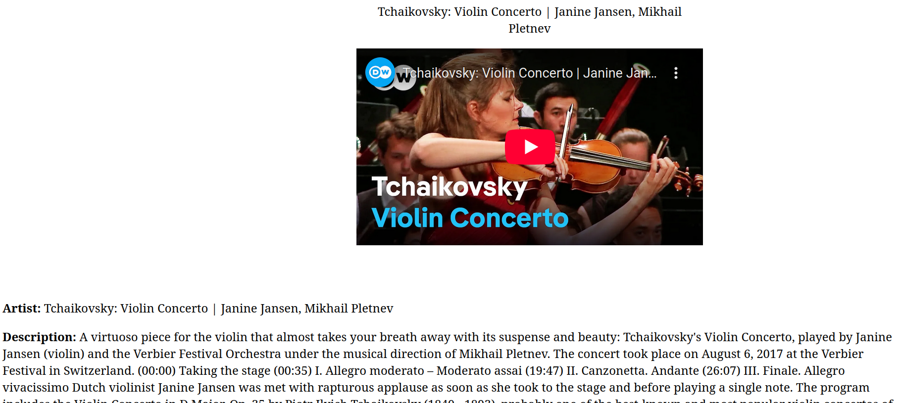
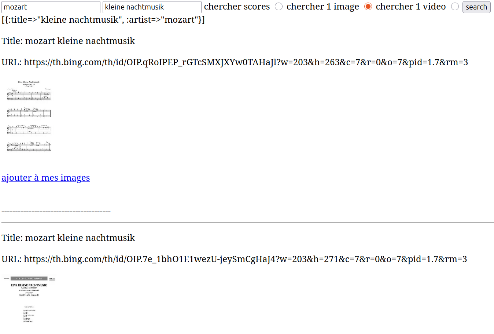
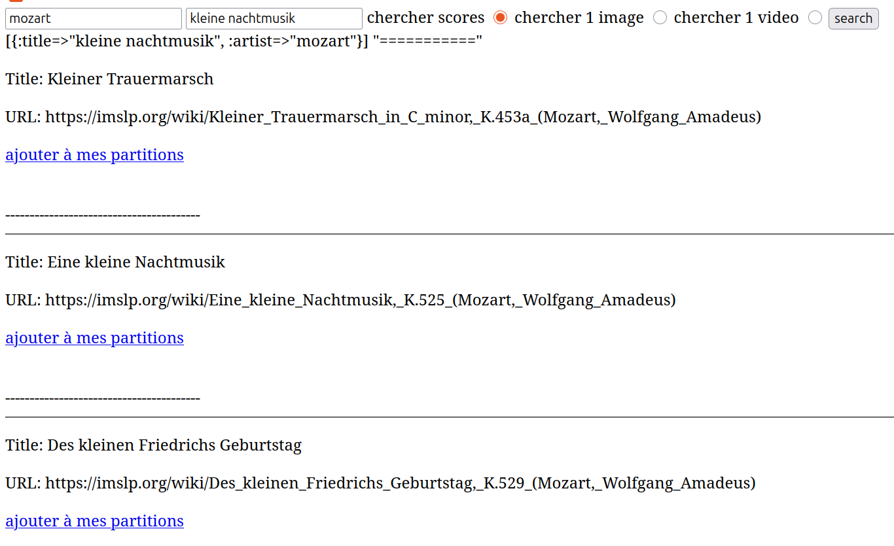
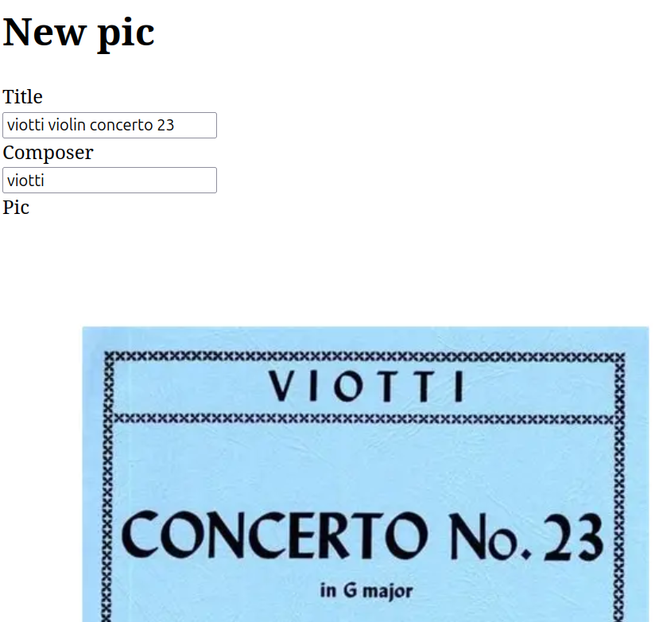
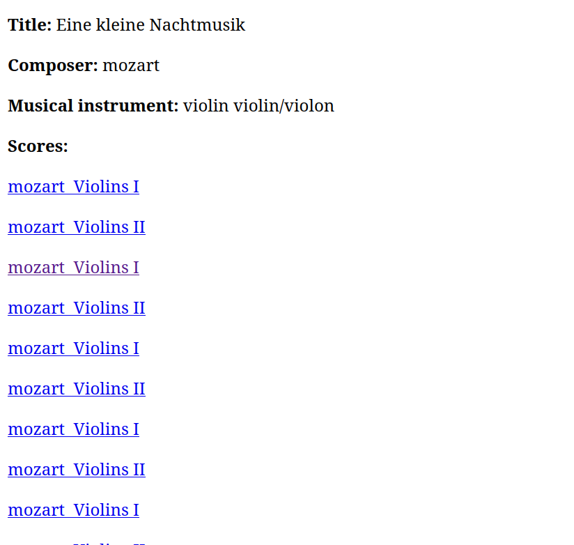

# README

- search score as if you on google, and save them to your database
- go and search for scores and videos of your favorite song on your musical instrument
- enjoy your search
- fais rvm use 3.3.3
- va dans identifiants, google cloud console, API et services, clés API, Youtube Data API v3
- fais export YOUTUBEAPIKEY="yourapikey"

